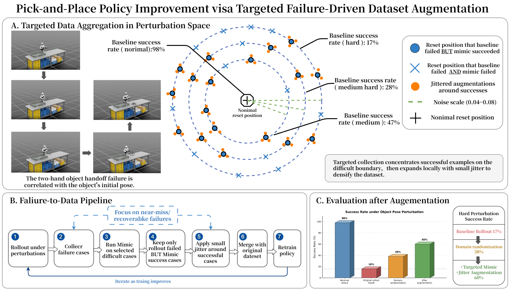

# IsaacLab G1 PickPlace

<p align="center">
  <a href="#english"><b>English</b></a> |
  <a href="#中文"><b>中文</b></a>
</p>

<p align="center">
  This repository reproduces the Isaac Lab G1 locomanipulation imitation learning pipeline, compares BC-RNN / Diffusion Policy / ACT, and explores failure-driven dataset augmentation for hard object-pose perturbations.<br>
  本项目复现 Isaac Lab G1 人形机器人移动操作模仿学习流程，对比 BC-RNN / Diffusion Policy / ACT，并进一步探索面向困难物体初始位姿扰动的失败定向数据增强。
</p>

<table align="center">
  <tr>
    <td align="center" width="33%">
      <b>robomimic BC-RNN</b><br>
      <sub>Official-style baseline</sub><br><br>
      
    </td>
    <td align="center" width="33%">
      <b>Diffusion Policy</b><br>
      <sub>Action sequence generation</sub><br><br>
      
    </td>
    <td align="center" width="33%">
      <b>ACT</b><br>
      <sub>Transformer action chunking</sub><br><br>
      
    </td>
  </tr>
</table>

<p align="center">
  
</p>

<p align="center">
  <sub>Failure-driven targeted dataset augmentation for hard object-pose perturbations.</sub>
</p>

---

## English

### Overview

This repository records my reproduction and debugging process for the **G1 pick-place / locomanipulation task in NVIDIA Isaac Lab**.

The project currently contains four parts:

1. Reproducing the official Isaac Lab G1 locomanipulation task and Mimic demonstration generation pipeline:

```text
Isaac-Locomanipulation-G1-Abs-Mimic-v0
Isaac-PickPlace-Locomanipulation-G1-Abs-v0
```

2. Training and evaluating the official-style robomimic BC-RNN baseline on G1 Mimic-generated demonstrations.

3. Extending the same demonstration dataset to two action-chunking policies:

```text
G1 Mimic demonstrations
→ low-dimensional zarr dataset
→ Diffusion Policy / ACT training
→ IsaacLab closed-loop rollout
```

4. Exploring a failure-driven targeted data augmentation procedure for hard object-pose perturbations:

```text
ACT rollout failures
→ Mimic teacher filtering
→ ACT-failed / Mimic-succeeded targeted demonstrations
→ local jitter augmentation
→ retraining and robustness evaluation
```

This project is based on the official NVIDIA Isaac Lab project:

```text
NVIDIA Isaac Lab
https://github.com/isaac-sim/IsaacLab
```

---

### Current Status

Verified:

- Isaac Sim 5.1 and Isaac Lab can run on a headless RTX 4090 server.
- The G1 locomanipulation pick-place task can be registered, reset, stepped, and rendered.
- The official annotated G1 locomanipulation dataset was downloaded and used as the seed dataset for Isaac Lab Mimic.
- Mimic successfully generated 1000 G1 locomanipulation demonstrations.
- Generated demonstrations can be replayed correctly by restoring `initial_state` and using raw 32-D `actions`.
- A robomimic BC-RNN policy was trained with 1000 Mimic-generated demonstrations for 1800 epochs.
- The BC-RNN policy achieved 48/50 successful rollouts in a preliminary 50-rollout evaluation.
- The same dataset was converted into a low-dimensional zarr dataset for Diffusion Policy and ACT training.
- A low-dimensional Diffusion Policy was trained and deployed back to IsaacLab for closed-loop rollout.
- A low-dimensional ACT policy was trained and deployed back to IsaacLab for closed-loop rollout.
- ACT trained for 500 epochs achieved 50/50 successful rollouts in a preliminary 50-rollout evaluation.
- Under hard object-pose perturbation, the original ACT rollout success rate dropped to 16%.
- Failure-driven targeted Mimic data aggregation improved the hard-perturbation success rate to 42% with targeted Mimic ×10 and 84% after local jitter augmentation.

This repository focuses on **G1 locomanipulation imitation learning reproduction, policy comparison, and targeted robustness augmentation**, rather than proposing a full new algorithm.

---

### Method Comparison

All three policies are trained or evaluated on the same G1 locomanipulation task and the same Mimic-generated demonstration source.

| Policy | Main idea | Implementation in this project | Preliminary result |
|---|---|---|---|
| BC-RNN | Recurrent behavior cloning baseline | robomimic low-dimensional BC-RNN trained on 1000 Mimic demos | 48/50 successful rollouts after 1800 epochs |
| Diffusion Policy | Generates action chunks through conditional denoising | G1 HDF5 demos converted to low-dimensional zarr; trained with Diffusion Policy and deployed back to IsaacLab | Closed-loop rollout verified; rollout alignment bug fixed |
| ACT | Predicts future action chunks directly with a Transformer-style policy | Minimal low-dimensional ACT implementation using `(obs_history=2, action_chunk=8)` | 50/50 successful rollouts after 500 epochs in a preliminary evaluation |

The current results should be interpreted as reproduction and engineering validation. The evaluation is still limited to simulation.

---

### Failure-Driven Dataset Augmentation

After the nominal ACT policy was trained, I evaluated it under harder object initial-pose perturbations. A key failure mode appeared during the two-hand object handoff: the robot could often reach and move the object, but the handoff became sensitive to the object initial pose.

Instead of blindly increasing domain randomization, this repository explores a targeted data aggregation procedure:

```text
1. Roll out the ACT policy under object-pose perturbations.
2. Collect reset cases where ACT fails.
3. Run Mimic on these difficult reset cases.
4. Keep only ACT-failed / Mimic-succeeded demonstrations.
5. Apply small local jitter around successful targeted cases.
6. Merge the targeted demonstrations with the original 1000-demo dataset.
7. Retrain and evaluate under hard perturbations.
```

<p align="center">
  
</p>

The key distinction from ordinary randomization is that the additional demonstrations are both policy-induced and teacher-filtered: they come from reset cases where the student policy fails but the Mimic teacher can still complete the task.

Targeted sample expansion statistics:

| Setting | ACT rollout failures | Targeted cases | Mimic success demos | Mimic success rate |
|---|---:|---:|---:|---:|
| medium_plus_1 | 49 | 196 | 73 | 37.24% |
| medium_plus_2 | 61 | 244 | 75 | 30.74% |
| medium_plus_3 | 72 | 288 | 52 | 18.06% |
| success_jitter | - | 115 | 54 | 46.96% |

Preliminary hard-perturbation robustness result:

| Evaluation setting | Success rate |
|---|---:|
| Nominal rollout | 98% |
| Original rollout under hard perturbation | 16% |
| Targeted Mimic ×10 | 42% |
| Targeted Mimic + local jitter augmentation | 84% |

These numbers are treated as simulation-side engineering validation of the targeted augmentation pipeline.

---

### Demo

#### robomimic BC-RNN policy rollout

The top-left GIF shows a successful rollout from the robomimic BC-RNN policy.

BC-RNN setup:

- Dataset: 1000 Mimic-generated demonstrations.
- Training: 1800 epochs.
- Evaluation: 48/50 successful rollouts in a preliminary test.
- Task: `Isaac-PickPlace-Locomanipulation-G1-Abs-v0`.

#### Low-dimensional Diffusion Policy rollout

The top-middle GIF shows a successful rollout from a low-dimensional Diffusion Policy trained on the same G1 Mimic-generated demonstrations.

Key implementation detail:

- The policy was trained with `n_obs_steps=2`, `n_action_steps=8`, and `horizon=16`.
- An early rollout script mistakenly used `horizon=16` as the observation history length.
- The corrected rollout uses `n_obs_steps=2` as the observation history length and executes the predicted action chunk with `exec_horizon`.

#### ACT rollout

The top-right GIF shows a successful rollout from a minimal low-dimensional ACT policy.

ACT setup:

- Dataset: the same 1000 G1 Mimic-generated demonstrations.
- Input: recent 2-step low-dimensional observation history.
- Output: 8-step 32-D action chunk.
- Training: 500 epochs.
- Evaluation: 50/50 successful rollouts in a preliminary test.

---

### Key Debugging Notes

#### 1. Task and environment setup

The G1 pick-place / locomanipulation task exists in the Isaac Lab source tree, but the corresponding modules need to be explicitly imported in custom scripts:

```python
import isaaclab_tasks.manager_based.manipulation.pick_place
import isaaclab_tasks.manager_based.locomanipulation.pick_place
```

Some environment-specific issues, such as Pinocchio / PinkIK initialization and QP solver compatibility, were handled during reproduction. These are treated as deployment details rather than core contributions.

---

#### 2. Generated demonstration replay

For generated G1 locomanipulation demonstrations, replaying in the wrong environment or using `processed_actions` can cause severe motion errors.

The corrected replay path is:

- use the dataset's Mimic environment,
- restore `initial_state`,
- replay raw 32-D `actions`,
- avoid feeding `processed_actions` into `env.step()`.

---

#### 3. Diffusion Policy rollout alignment

The most important Diffusion Policy deployment issue was the difference between `horizon`, `n_obs_steps`, and `n_action_steps`.

The trained checkpoint used:

```text
horizon = 16
n_obs_steps = 2
n_action_steps = 8
```

The initial rollout script incorrectly used:

```text
obs_history_len = horizon = 16
```

The correct rollout setting is:

```text
obs_history_len = n_obs_steps = 2
```

Using the wrong observation history length caused the online policy input distribution to differ from training, leading to slow and unstable motion. After this fix, the Diffusion Policy rollout became normal.

---

#### 4. ACT rollout deployment

The ACT policy uses the same low-dimensional observation and action interface as the Diffusion Policy extension, but predicts the action chunk directly instead of using iterative denoising.

The main deployment checks were:

- restoring observation and action normalization from the checkpoint,
- using `obs_history_len=2`,
- outputting an 8-step 32-D action chunk,
- executing the chunk with `exec_horizon`,
- keeping the video recording path consistent with the non-video rollout path.

---

### Roadmap

- [x] Install Isaac Sim 5.1 and Isaac Lab on a headless server.
- [x] Generate G1 locomanipulation demonstrations with Isaac Lab Mimic.
- [x] Replay generated demonstrations without robot flipping.
- [x] Train and evaluate robomimic BC-RNN on 1000 G1 demonstrations.
- [x] Convert G1 demonstrations into a low-dimensional zarr dataset.
- [x] Train and deploy low-dimensional Diffusion Policy for IsaacLab closed-loop rollout.
- [x] Train and deploy low-dimensional ACT for IsaacLab closed-loop rollout.
- [x] Export successful rollout GIFs for BC-RNN, Diffusion Policy, and ACT.
- [x] Add failure-mode statistics under object initial-pose perturbations.
- [x] Build ACT-failed / Mimic-succeeded targeted demonstration sets.
- [x] Add local jitter augmentation around successful targeted cases.
- [x] Evaluate hard object-pose perturbation robustness after targeted dataset augmentation.
- [ ] Evaluate robustness under broader object / target / physics randomization.

---

## 中文

### 项目简介

本仓库记录我对 **NVIDIA Isaac Lab 中 G1 pick-place / locomanipulation 任务** 的复现、调试、策略对比与失败定向数据增强过程。

目前项目包含四部分：

1. 复现 Isaac Lab 官方 G1 locomanipulation 任务与 Mimic demonstration 生成流程：

```text
Isaac-Locomanipulation-G1-Abs-Mimic-v0
Isaac-PickPlace-Locomanipulation-G1-Abs-v0
```

2. 基于同一批 G1 Mimic demonstration 训练并评估官方风格的 robomimic BC-RNN baseline。

3. 将同一批 demonstration 扩展到两类动作块生成策略：

```text
G1 Mimic demonstrations
→ low-dimensional zarr dataset
→ Diffusion Policy / ACT training
→ IsaacLab closed-loop rollout
```

4. 在 ACT 已能稳定完成 nominal 任务后，进一步探索 hard 物体初始位姿扰动下的失败定向数据增强：

```text
ACT rollout 失败样本
→ Mimic teacher 筛选
→ 只保留 ACT failed / Mimic succeeded 的 targeted demonstrations
→ 围绕成功样本做局部 jitter 扩增
→ 合并原始数据集后重新训练并评估鲁棒性
```

本项目基于 NVIDIA 官方 Isaac Lab：

```text
NVIDIA Isaac Lab
https://github.com/isaac-sim/IsaacLab
```

---

### 当前进度

目前已经验证：

- Isaac Sim 5.1 与 Isaac Lab 可以在无桌面的 RTX 4090 服务器上运行。
- G1 locomanipulation pick-place 任务可以正常注册、reset、step 与渲染。
- 已下载官方 G1 locomanipulation annotated dataset，并作为 Isaac Lab Mimic 的种子数据。
- 已使用 Mimic 成功生成 1000 条 G1 locomanipulation demonstration。
- Generated demonstration 可以通过恢复 `initial_state` 并回放 32 维 raw `actions` 正确执行。
- 已使用 1000 条 Mimic demonstration 训练 robomimic BC-RNN 策略 1800 epochs。
- BC-RNN 策略在 50 次初步 rollout 评估中成功 48 次。
- 已将同一批 demonstration 转换为 low-dimensional zarr 数据集，用于 Diffusion Policy 与 ACT 训练。
- 已训练 low-dimensional Diffusion Policy，并接回 IsaacLab 完成闭环 rollout。
- 已训练 low-dimensional ACT，并接回 IsaacLab 完成闭环 rollout。
- ACT 训练 500 epochs 后，在一次 50-rollout 初步评估中达到 50/50 成功。
- 在 hard object-pose perturbation 下，原始 ACT rollout 成功率下降到 16%。
- 通过 ACT failed / Mimic succeeded 样本筛选与局部 jitter 扩增，hard perturbation 成功率从 16% 提升到 84%。

本仓库主要关注 **G1 移动操作模仿学习流程复现、策略对比与失败定向数据增强探索**，不声称提出完整的新算法。

---

### 方法对比

三种策略使用同一个 G1 locomanipulation 任务和同一批 Mimic 生成 demonstration。

| 策略 | 核心思路 | 本项目中的实现 | 初步结果 |
|---|---|---|---|
| BC-RNN | 递归式行为克隆 baseline | 使用 robomimic low-dimensional BC-RNN，在 1000 条 Mimic demo 上训练 | 1800 epochs 后 48/50 成功 |
| Diffusion Policy | 通过条件去噪生成动作块 | 将 G1 HDF5 demo 转换为 low-dimensional zarr，训练 Diffusion Policy 并部署回 IsaacLab | 已完成闭环 rollout，并修复观测历史长度错配问题 |
| ACT | 使用 Transformer 风格策略直接预测未来动作块 | 实现最小 low-dimensional ACT，输入 2 步状态历史，输出 8 步动作块 | 500 epochs 后 50/50 成功 |

当前结果更适合理解为复现与工程验证。评估仍然局限在仿真环境下。

---

### 失败定向数据增强

在 nominal 设置下，ACT 可以稳定完成 G1 pick-place / locomanipulation 任务。但在更大的物体初始位姿扰动下，策略成功率会明显下降。观察失败视频后可以看到，一个关键失败模式出现在双手交接阶段：机器人能够接近并移动物体，但当物体初始位置更困难时，右手接取或交接更容易失败。也就是说，双手交接的成功与物体初始位姿高度相关。

本项目没有直接无差别扩大随机化范围，而是采用失败定向的数据聚合流程：

```text
1. 在物体初始位姿扰动下 rollout ACT 策略；
2. 收集 ACT 失败的 reset case；
3. 在这些困难 reset case 上运行 Mimic；
4. 只保留 ACT failed / Mimic succeeded 的 demonstration；
5. 围绕 Mimic 成功样本做小范围 jitter 扩增；
6. 与原始 1000 条 demonstration 合并；
7. 重新训练 ACT 并在 hard perturbation 下评估。
```

<p align="center">
  
</p>

这与普通 domain randomization 的区别在于：新增数据不是随机采样得到的，而是由 ACT 自身的失败分布触发，并经过 Mimic teacher 过滤。只有“学生策略失败、Mimic 仍能成功”的样本才进入训练集。

扩展样本统计：

| 设置 | ACT rollout failures | targeted cases | Mimic success demos | Mimic success rate |
|---|---:|---:|---:|---:|
| medium_plus_1 | 49 | 196 | 73 | 37.24% |
| medium_plus_2 | 61 | 244 | 75 | 30.74% |
| medium_plus_3 | 72 | 288 | 52 | 18.06% |
| success_jitter | - | 115 | 54 | 46.96% |

初步 hard perturbation 结果：

| 评估设置 | 成功率 |
|---|---:|
| Nominal rollout | 98% |
| Original rollout under hard perturbation | 16% |
| Targeted Mimic ×10 | 42% |
| Targeted Mimic + local jitter augmentation | 84% |

这些结果主要用于说明：基于策略失败分布的 targeted dataset augmentation 可以有效提升困难物体初始位姿条件下的仿真鲁棒性。

---

### 演示

#### robomimic BC-RNN 策略 rollout

顶部左侧 GIF 展示的是 robomimic BC-RNN 策略的一次成功 rollout。

BC-RNN 设置：

- 数据集：1000 条 Mimic 生成 demonstration。
- 训练轮数：1800 epochs。
- 初步评估：50 次 rollout 中成功 48 次。
- 任务：`Isaac-PickPlace-Locomanipulation-G1-Abs-v0`。

#### Low-dimensional Diffusion Policy rollout

顶部中间 GIF 展示的是基于同一批 G1 Mimic demonstration 训练得到的 low-dimensional Diffusion Policy 的一次成功 rollout。

关键实现细节：

- Diffusion Policy 训练时使用 `n_obs_steps=2`、`n_action_steps=8`、`horizon=16`。
- 初版 IsaacLab rollout 脚本误将 `horizon=16` 当作观测历史长度。
- 修正后使用 `n_obs_steps=2` 作为观测历史长度，并通过 `exec_horizon` 执行预测出的 action chunk。

#### ACT rollout

顶部右侧 GIF 展示的是 minimal low-dimensional ACT 策略的一次成功 rollout。

ACT 设置：

- 数据集：同一批 1000 条 G1 Mimic demonstration。
- 输入：最近 2 步 low-dimensional observation history。
- 输出：8 步 32 维 action chunk。
- 训练轮数：500 epochs。
- 初步评估：50 次 rollout 中成功 50 次。

---

### 关键调试记录

#### 1. 任务与环境部署

G1 pick-place / locomanipulation 任务存在于 Isaac Lab 源码中，但在自定义脚本中需要显式导入相关模块：

```python
import isaaclab_tasks.manager_based.manipulation.pick_place
import isaaclab_tasks.manager_based.locomanipulation.pick_place
```

复现过程中也处理了 Pinocchio / PinkIK 初始化、QP solver 兼容和 headless 可视化导出等问题。这些属于部署细节，在本项目中不作为主要贡献展开。

---

#### 2. Generated demonstration 回放

对于 generated G1 locomanipulation demo，如果使用错误环境回放，或者把 `processed_actions` 直接传给 `env.step()`，机器人会出现明显异常运动。

修正后的回放路径是：

- 使用数据集对应的 Mimic 环境；
- 恢复 `initial_state`；
- 回放 32 维原始 `actions`；
- 不把 `processed_actions` 传给 `env.step()`。

---

#### 3. Diffusion Policy rollout 观测历史长度错配

在 low-dimensional Diffusion Policy 接入 IsaacLab rollout 时，最关键的问题是区分 `horizon`、`n_obs_steps` 和 `n_action_steps`。

当前 checkpoint 使用：

```text
horizon = 16
n_obs_steps = 2
n_action_steps = 8
```

初版 rollout 脚本错误使用：

```text
obs_history_len = horizon = 16
```

正确做法应为：

```text
obs_history_len = n_obs_steps = 2
```

该错误会导致在线 rollout 时输入给 policy 的观测历史与训练时不一致，表现为动作迟缓、发钝和抖动。修正为 `n_obs_steps=2` 后，Diffusion Policy 能够正常完成任务。

---

#### 4. ACT rollout 部署

ACT 与 Diffusion Policy 使用相同的 low-dimensional observation / action 接口，但 ACT 直接预测动作块，不进行扩散去噪。

ACT 部署时主要检查：

- 从 checkpoint 恢复 observation / action normalization；
- 使用 `obs_history_len=2`；
- 输出 8 步 32 维 action chunk；
- 通过 `exec_horizon` 执行动作块；
- 保证视频录制路径不改变原本的 rollout 控制逻辑。

---

### 后续计划

- [x] 在无桌面服务器上安装 Isaac Sim 5.1 和 Isaac Lab。
- [x] 使用 Isaac Lab Mimic 生成 G1 locomanipulation demonstration。
- [x] 成功回放 generated demonstration，机器人不再乱翻滚。
- [x] 使用 1000 条 Mimic demonstration 训练 robomimic BC-RNN 策略。
- [x] 将 G1 demonstration 转换为 low-dimensional zarr 数据集。
- [x] 训练并部署 low-dimensional Diffusion Policy，完成 IsaacLab G1 闭环 rollout。
- [x] 训练并部署 low-dimensional ACT，完成 IsaacLab G1 闭环 rollout。
- [x] 导出 BC-RNN、Diffusion Policy 和 ACT 的成功 rollout GIF。
- [x] 统计 hard object-pose perturbation 下的失败样本。
- [x] 构建 ACT failed / Mimic succeeded targeted demonstration 集合。
- [x] 围绕 Mimic 成功样本做局部 jitter 扩增。
- [x] 评估 targeted dataset augmentation 对 hard perturbation 成功率的提升。
- [ ] 在更大范围的物体、目标位置和物理参数扰动下评估策略鲁棒性。
