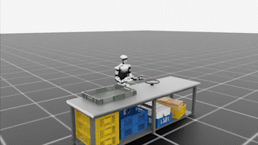

# IsaacLab G1 PickPlace

<p align="center">
  <a href="#english"><b>English</b></a> |
  <a href="#中文"><b>中文</b></a>
</p>

<p align="center">
  
</p>

---

## English

### Overview

This repository records my reproduction and debugging process for the **G1 pick-place tasks in NVIDIA Isaac Lab**.

The work currently covers two parts:

1. Reproducing and debugging the fixed-base upper-body G1 pick-place environment:

```text
Isaac-PickPlace-FixedBaseUpperBodyIK-G1-Abs-v0
```

2. Replaying generated G1 locomanipulation demonstrations from the official Isaac Lab Mimic pipeline:

```text
Isaac-Locomanipulation-G1-Abs-Mimic-v0
Isaac-PickPlace-Locomanipulation-G1-Abs-v0
```

This project is based on the official NVIDIA Isaac Lab project:

```text
NVIDIA Isaac Lab
https://github.com/isaac-sim/IsaacLab
```

This repository is **not a fork or mirror of Isaac Lab**. It only contains reproduction scripts, debugging notes, and minimal patches used during the reproduction process.

---

### Current Status

Verified:

- Isaac Sim 5.1 runs on a headless RTX 4090 server.
- Isaac Lab is installed from source.
- `Isaac-PickPlace-FixedBaseUpperBodyIK-G1-Abs-v0` can be registered, reset, and stepped.
- The fixed-base upper-body action dimension is verified as 28.
- PinkIK solver compatibility was fixed by switching from `daqp` to `quadprog`.
- Stable G1 visualization was exported in headless mode.
- The official annotated G1 locomanipulation dataset was downloaded.
- Mimic successfully generated G1 locomanipulation demonstrations.
- A generated demo can be replayed and exported as GIF/MP4 without robot flipping.


---

### Demo

The GIF above shows a replayed generated G1 locomanipulation demonstration.

Important note:

- This is a **generated demonstration replay**, not a trained policy rollout.
- The replay uses raw 32-D `actions`, restores `initial_state`, and runs in the dataset's Mimic environment.
- `processed_actions` are internal expanded action targets and should not be fed into `env.step()`.

---

### Key Debugging Notes

#### 1. PickPlace task registration

The G1 pick-place task exists in the Isaac Lab source tree, but the corresponding pick-place modules may not be automatically imported by a normal task listing.

The scripts explicitly import:

```python
import isaaclab_tasks.manager_based.manipulation.pick_place
import isaaclab_tasks.manager_based.locomanipulation.pick_place
```

---

#### 2. Pinocchio / PinkIK initialization

This task depends on PinkIK and Pinocchio. In my environment, Pinocchio needs to be imported before launching Isaac Sim.

The custom scripts therefore support:

```bash
--enable_pinocchio
```

---

#### 3. PinkIK solver compatibility

The default PinkIK QP solver caused this error:

```text
solve() got an unexpected keyword argument 'primal_start'
```

The minimal fix was to switch the PinkIK solver from:

```python
solver="daqp"
```

to:

```python
solver="quadprog"
```

The patch note is stored in:

```text
patches/fix_pinkik_solver_quadprog.patch
```

---

#### 4. Generated demo replay

For generated G1 locomanipulation demos, replaying in the wrong environment or using `processed_actions` can cause the robot to flip.

The corrected replay path is:

- use the dataset's Mimic environment,
- restore `initial_state`,
- replay raw 32-D `actions`,
- avoid feeding `processed_actions` into `env.step()`.

---

### Smoke Test

Run from the Isaac Lab root directory:

```bash
cd /root/autodl-tmp/IsaacLab
source /root/miniconda3/etc/profile.d/conda.sh
conda activate /root/autodl-tmp/conda_envs/isaacsim-5.1.0

unset LD_LIBRARY_PATH
export TERM=xterm
export OMNI_KIT_ACCEPT_EULA=YES

./isaaclab.sh -p -u scripts/g1_pickplace_smoke.py \
  --task Isaac-PickPlace-FixedBaseUpperBodyIK-G1-Abs-v0 \
  --num_envs 1 \
  --headless \
  --enable_pinocchio
```

Expected output:

```text
[INFO] reset ok
[INFO] action_dim: 28
[INFO] step 0 ok
[INFO] step 5 ok
[INFO] step 10 ok
[INFO] step 15 ok
```

---

### Generated Demo Replay

```bash
cd /root/autodl-tmp/IsaacLab
source /root/miniconda3/etc/profile.d/conda.sh
conda activate /root/autodl-tmp/conda_envs/isaacsim-5.1.0

unset LD_LIBRARY_PATH
export TERM=xterm
export OMNI_KIT_ACCEPT_EULA=YES

./isaaclab.sh -p scripts/g1_locomanip_replay_mp4.py \
  --device cpu \
  --dataset_file /root/autodl-tmp/IsaacLab/datasets/generated_dataset_g1_locomanip_20.hdf5 \
  --demo_key demo_0 \
  --fps 50 \
  --output /root/autodl-tmp/IsaacLab/videos/g1_locomanip_demo_0.mp4 \
  --headless \
  --enable_pinocchio
```
---

### Roadmap

- [x] Install Isaac Sim 5.1 and Isaac Lab on a headless server.
- [x] Register and launch the G1 fixed-base upper-body pick-place task.
- [x] Fix PinkIK solver compatibility.
- [x] Export stable G1 visualization video.
- [x] Download official annotated G1 locomanipulation dataset.
- [x] Generate G1 locomanipulation demonstrations with Mimic.
- [x] Replay generated demonstration without robot flipping.
- [ ] Train a robomimic BC-RNN policy.
- [ ] Export trained policy rollout videos.

---

## 中文

### 项目简介

本仓库记录我对 **NVIDIA Isaac Lab 中 G1 pick-place 相关任务** 的复现与调试过程。

目前包含两部分：

1. 复现和调试 fixed-base upper-body G1 pick-place 环境：

```text
Isaac-PickPlace-FixedBaseUpperBodyIK-G1-Abs-v0
```

2. 复现 Isaac Lab 官方 Mimic 流程生成的 G1 locomanipulation demonstration 回放：

```text
Isaac-Locomanipulation-G1-Abs-Mimic-v0
Isaac-PickPlace-Locomanipulation-G1-Abs-v0
```

本项目基于 NVIDIA 官方 Isaac Lab：

```text
NVIDIA Isaac Lab
https://github.com/isaac-sim/IsaacLab
```


---

### 当前进度

目前已经验证：

- Isaac Sim 5.1 可以在无桌面的 RTX 4090 服务器上运行。
- Isaac Lab 源码环境可以正常启动。
- `Isaac-PickPlace-FixedBaseUpperBodyIK-G1-Abs-v0` 可以成功注册、reset 和 step。
- fixed-base upper-body 动作维度确认为 28。
- 已通过将 PinkIK solver 从 `daqp` 改为 `quadprog` 修复求解器兼容问题。
- 已在 headless 模式下稳定导出 G1 可视化结果。
- 已下载官方 G1 locomanipulation annotated dataset。
- 已使用 Mimic 成功生成 G1 locomanipulation demonstration。
- 已成功回放 generated demo，并导出 GIF/MP4，机器人不再乱翻滚。

当前仓库主要处于**环境复现、调试和 generated demonstration 回放阶段**，还没有包含训练好的 pick-place 策略。

---

### 演示

上方 GIF 展示的是一条 generated G1 locomanipulation demonstration 的回放。

注意：

- 这不是训练后策略的 rollout，而是 demonstration replay。
- 回放时使用 32 维原始 `actions`，恢复 `initial_state`，并在数据集对应的 Mimic 环境中执行。
- `processed_actions` 是内部展开后的动作目标，不能直接传给 `env.step()`。

---

### 关键调试记录

#### 1. PickPlace 任务注册问题

G1 pick-place 任务本身存在于 Isaac Lab 源码中，但相关 pick-place 模块不一定会被普通任务列表自动导入。

因此脚本中需要显式导入：

```python
import isaaclab_tasks.manager_based.manipulation.pick_place
import isaaclab_tasks.manager_based.locomanipulation.pick_place
```

---

#### 2. Pinocchio / PinkIK 初始化问题

该任务依赖 PinkIK 和 Pinocchio。在当前环境中，需要在 Isaac Sim 启动前先导入 Pinocchio。

因此自定义脚本支持：

```bash
--enable_pinocchio
```

---

#### 3. PinkIK 求解器兼容问题

PinkIK 默认 QP solver 在当前环境中会报错：

```text
solve() got an unexpected keyword argument 'primal_start'
```

最小修复方式是把 PinkIK solver 从：

```python
solver="daqp"
```

改为：

```python
solver="quadprog"
```

补丁说明保存在：

```text
patches/fix_pinkik_solver_quadprog.patch
```

---

#### 4. Generated demo 回放问题

对于 generated G1 locomanipulation demo，如果使用错误环境回放，或者把 `processed_actions` 直接传给 `env.step()`，机器人会乱翻滚。

修正后的回放路径是：

- 使用数据集对应的 Mimic 环境；
- 恢复 `initial_state`；
- 回放 32 维原始 `actions`；
- 不把 `processed_actions` 传给 `env.step()`。

---

### Smoke Test

在 Isaac Lab 根目录运行：

```bash
cd /root/autodl-tmp/IsaacLab
source /root/miniconda3/etc/profile.d/conda.sh
conda activate /root/autodl-tmp/conda_envs/isaacsim-5.1.0

unset LD_LIBRARY_PATH
export TERM=xterm
export OMNI_KIT_ACCEPT_EULA=YES

./isaaclab.sh -p -u scripts/g1_pickplace_smoke.py \
  --task Isaac-PickPlace-FixedBaseUpperBodyIK-G1-Abs-v0 \
  --num_envs 1 \
  --headless \
  --enable_pinocchio
```

期望输出：

```text
[INFO] reset ok
[INFO] action_dim: 28
[INFO] step 0 ok
[INFO] step 5 ok
[INFO] step 10 ok
[INFO] step 15 ok
```

---

### Generated Demo 回放

```bash
cd /root/autodl-tmp/IsaacLab
source /root/miniconda3/etc/profile.d/conda.sh
conda activate /root/autodl-tmp/conda_envs/isaacsim-5.1.0

unset LD_LIBRARY_PATH
export TERM=xterm
export OMNI_KIT_ACCEPT_EULA=YES

./isaaclab.sh -p scripts/g1_locomanip_replay_mp4.py \
  --device cpu \
  --dataset_file /root/autodl-tmp/IsaacLab/datasets/generated_dataset_g1_locomanip_20.hdf5 \
  --demo_key demo_0 \
  --fps 50 \
  --output /root/autodl-tmp/IsaacLab/videos/g1_locomanip_demo_0.mp4 \
  --headless \
  --enable_pinocchio
```

---

### 后续计划

- [x] 在无桌面服务器上安装 Isaac Sim 5.1 和 Isaac Lab。
- [x] 注册并启动 G1 fixed-base upper-body pick-place 任务。
- [x] 修复 PinkIK solver 兼容问题。
- [x] 导出稳定的 G1 可视化视频。
- [x] 下载官方 G1 locomanipulation annotated dataset。
- [x] 使用 Mimic 生成 G1 locomanipulation demonstration。
- [x] 成功回放 generated demonstration，机器人不再乱翻滚。
- [ ] 训练 robomimic BC-RNN 策略。
- [ ] 导出训练后策略 rollout 视频。